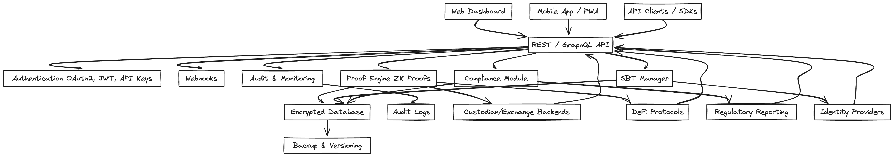

# Future Product Idea

---

## 1. Modern Frontend/UI
- **Web Dashboard**: Build a responsive dashboard for:
  - Uploading balance data and thresholds
  - Viewing proof status and logs
  - Visualizing reserve coverage, audit history, and alerts
- **User Roles**: Support for admins, auditors, and public viewers
- **Mobile Support**: PWA or native mobile app

## 2. API Integration
- **REST & GraphQL APIs**: Expose endpoints for submitting proofs, querying results, and integrating with custodial/exchange backends
- **Authentication**: OAuth2, JWT, or API keys for secure access
- **Webhooks**: Notify external systems when proofs are generated or verified
- **SDKs**: Client libraries for popular languages

## 3. Data Management
- **Database**: Store proof submissions, results, and audit logs in a scalable database
- **Data Privacy**: Encrypt sensitive data at rest and in transit
- **Versioning**: Track changes to reserve data and thresholds for compliance
- **Backup & Recovery**: Automated backups, disaster recovery planning

## 4. Low-Latency Proving & Verifying
- **Optimized Circuits**: Refactor proof logic for faster execution
- **Hardware Acceleration**: Use GPUs or specialized hardware for proof generation
- **Caching**: Cache recent proofs and verification results for instant access
- **Horizontal Scaling**: Distribute proof jobs across multiple servers/containers

## 5. Productization Considerations
- **Scalability**: Design for high throughput (many assets, frequent proofs)
- **Security**: Harden all endpoints, use secure enclaves for sensitive operations
- **Compliance**: Support audit trails, regulatory reporting, and third-party attestation
- **Extensibility**: Modular architecture for supporting new asset types, liability proofs, or integrations
- **Monitoring**: Real-time health checks, metrics, and alerting
- **DevOps**: CI/CD pipelines, automated testing, and staged deployments

## 6. Example Product Architecture

---

## 7. Next Steps
- Prototype a web dashboard with live proof submission
- Add REST API endpoints for integration
- Benchmark proof generation time and optimize
- Plan for compliance and audit requirements

---
